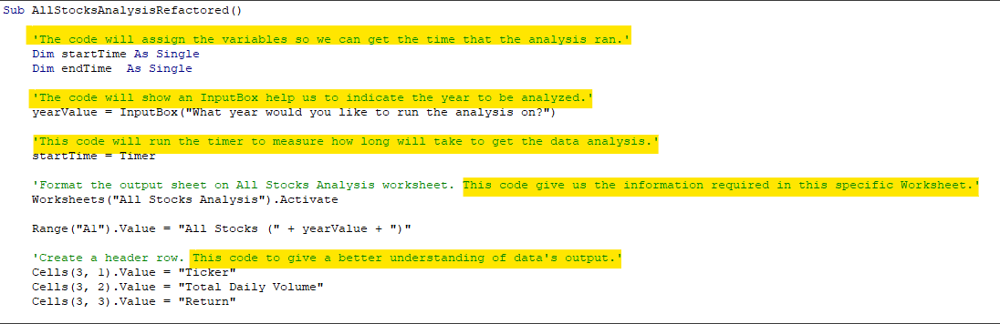
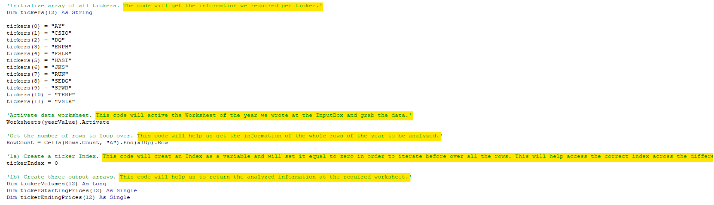
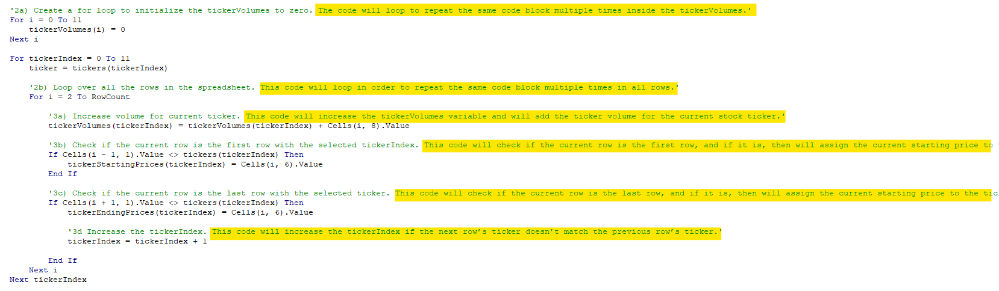
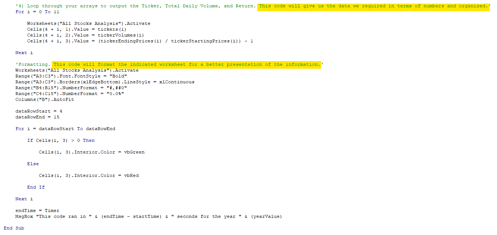

<!--
Deliverable 2 Requirements
    Structure, Organization, and Formatting Requirements (8 points)
        The written analysis contains the following structure, organization, and formatting:

            - There is a title, and there are multiple paragraphs (2 pt).
            - Each paragraph has a heading (2 pt).
            - There are subheadings to break up text (2 pt).
            - Links are working, and images are formatted and displayed where appropriate (2 pt).
-->

# Refactor VBA code and measure performance for Stock Analysis

## ***Overview of Project***

### **Purpose**
<!The purpose and background are well defined (2 pt).¡>
Deliver Steve a brief analysis to compare the stock performance between 2017 and 2018, with a workbook that will help him obtain consolidated and structured information on the data of the stocks in relation to the selected year. As well that the workbook will help him expand the dataset to include the entire stock market over the last few years with an improved 'macro' that will take a short time to execute.

## ***Results***
<!The analysis is well described with screenshots and code (4 pt).¡>

### **Compare the stock performance**

<table>
    <tr>
        <td>All Stocks (2017)</td>
        <td>&nbsp;&nbsp;&nbsp;&nbsp;&nbsp;&nbsp;</td>
        <td>All Stocks (2018)</td>
    </tr>
    <tr>
        <td></td>
        <td>&nbsp;&nbsp;&nbsp;&nbsp;&nbsp;&nbsp;</td>
        <td></td>
    </tr>
 </table>
 <tr>

    As we can observe the performance of both years are quite different, there's no similarity between both results neither in "Total Daily Volume", non "Rerturn".

    It would be of great help to have at least one more year to have a three year comparation, but here is what we can infer:
        - In 2017, for almost all companies ("Tickers") was a good year in terms of "Return". Only one company, TERP, had a negative return.
        - In 2018, 83.33% of the compared companies have red numbers in terms of returns, we can speculate that it was the worst year for stocks since the financial crisis.
        - Finally, as a small tendency we can observe that ENPH and RUN had a positve return, and TERP had a negative return in both years; a curious fact is tht the three had a higher "Total Daily Volume" in 2018 vs. 2017.

### **Execution time of the original vs. refactored script**

<table>
    <tr>
        <td>All Stocks (2017) - First Code</td>
        <td>&nbsp;&nbsp;</td>
        <td>All Stocks (2017) - Refactored Code</td>
    </tr>
    <tr>
        <td></td>
        <td>&nbsp;&nbsp;</td>
        <td></td>
    </tr>
 </table>
 <tr>

<table>
    <tr>
        <td>All Stocks (2018) - First Code</td>
        <td>&nbsp;&nbsp;</td>
        <td>All Stocks (2018) - Refactored Code</td>
    </tr>
    <tr>
        <td></td>
        <td>&nbsp;&nbsp;</td>
        <td></td>
    </tr>
 </table>
 <tr>

    As we can see in both years' comparisons, the refactoring of the code improved the time execution in both cases, and in less than a second we are getting the information. That is ±1.10 seconds less than the original script. 

### **Examples of your code**

(*) *The next images will be for display of the code, for a better reading of the full highlighted written comments per code step, refer to the VBA_Challengge.xlsm at the files section of the repository*

<table>
    <tr>
        <td>First Part</td>
    </tr>
    <tr>
        <td></td>
    </tr>
 </table>
 <tr>

    - The first part mainly sets where the information we require for the analysis is taken from. This mostly comes from the original code.

<table>
    <tr>
        <td>Second Part</td>
    </tr>
    <tr>
        <td></td>
    </tr>
 </table>
 <tr>

    - The second part start the setup to work with arrays with the same data type in order to have a more optimal code. This is where it starts the refactoring.

<table>
    <tr>
        <td>Third Part</td>
    </tr>
    <tr>
        <td></td>
    </tr>
 </table>
 <tr>

    - The third part sets the storing of the values with a structured set of commands to efficient the information we required. This is where most of the refactoring happens.

<table>
    <tr>
        <td>Fourth Part</td>
    </tr>
    <tr>
        <td></td>
    </tr>
 </table>
 <tr>

    - The fourth part is to display the output of the collected information. This also comes mostly from the original code.

## ***Summary: In a summary statement, address the following questions.***

### **What are the advantages or disadvantages of refactoring code?**
<!There is a detailed statement on the advantages and disadvantages of refactoring code in general (3 pt).¡>

- Advantages
  - Improve an internal structure of a previous code.
  - Debug the code in order to find errors or unnecessary parts.
  - If the source code works correctly and is clear (preferably with comments), it should be quick to end the final refactored code.
  
  Refactoring consists of improving the internal structure of an existing program's source code, while preserving its external behavior. The noun “refactoring” refers to one particular behavior-preserving transformation, such as “Extract Method” or “Introduce Parameter.”

- Disadvantages
  - It is needed to take in mind that even if we improve the internal structure of the code, we need to preserve the actions of the code. In other words, improve internally - same actions externally.
  - IF we don't debug correclty, we might be adding errors and/or bugs.
  - If there's no comments or at least clarity of the code's commands, it could be more tedious and complicated.

### **How do these pros and cons apply to refactoring the original VBA script?**
<!There is a detailed statement on the advantages and disadvantages of the original and refactored VBA script (3 pt).¡>

- Advantages
  - There was an improve in internal structure with a shorter code.
  - The time execution is better with the refactored code.
  - The refactored code grab, condensed and dispose the information already with a preset format (colors, percentages and commas in big numbers).

- Disadvantages
  - Even though it is cleared that the refactored code works better, it is not a certainty that it is most neat code.
  - For the moment the code only takes a certain number of 'tickers', if data sheets needs to add one or more, the code needs to be restructured.