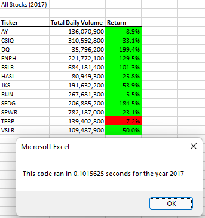
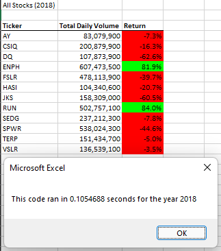
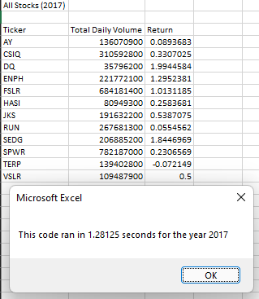
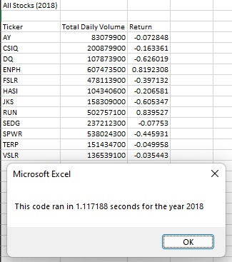

<!--
Deliverable 2 Requirements
    Structure, Organization, and Formatting Requirements (8 points)
        The written analysis contains the following structure, organization, and formatting:

            - There is a title, and there are multiple paragraphs (2 pt).
            - Each paragraph has a heading (2 pt).
            - There are subheadings to break up text (2 pt).
            - Links are working, and images are formatted and displayed where appropriate (2 pt).
-->

# Refactor VBA code and measure performance for Stock Analysis

## ***Overview of Project***

### **Purpose**
<!The purpose and background are well defined (2 pt).¡>
Deliver Steve a brief analysis to compare the stock performance between 2017 and 2018, with a workbook that will help him obtain consolidated and structured information on the data of the stocks in relation to the selected year. As well that the workbook will help him expand the dataset to include the entire stock market over the last few years with an improved 'macro' that will take a short time to execute.

## ***Results: Using images and examples of your code, compare the stock performance between 2017 and 2018, as well as the execution times of the original script and the refactored script.***
<!The analysis is well described with screenshots and code (4 pt).¡>

### **Compare the stock performance**

<table>
    <tr>
        <td>All Stocks (2017)</td>
        <td>&nbsp;&nbsp;&nbsp;&nbsp;&nbsp;&nbsp;</td>
        <td>All Stocks (2018)</td>
    </tr>
    <tr>
        <td></td>
        <td>&nbsp;&nbsp;&nbsp;&nbsp;&nbsp;&nbsp;</td>
        <td></td>
    </tr>
 </table>
 <tr>

    As we can observe the performance of both years are quite different, there's no similarity between both results neither in "Total Daily Volume", non "Rerturn".

    It would be of great help to have at least one more year to have a three year comparation, but here is what we can infer:
        - In 2017, for almost all companies ("Tickers") was a good year in terms of "Return". Only one company, TERP, had a negative return.
        - In 2018, 83.33% of the compared companies have red numbers in terms of returns, we can even speculate that it was the worst year for stocks since the financial crisis.
        - Finally, as a small tendency we can observe that ENPH and RUN had a positve return, and TERP had a negative return in both years; the three had a higher "Total Daily Volume" in 2018 vs. 2017.

<table>
    <tr>
        <td>All Stocks (2017) - First Code</td>
        <td>&nbsp;&nbsp;</td>
        <td>All Stocks (2017) - Refactored Code</td>
        <td>&nbsp;&nbsp;</td>
        <td>All Stocks (2018) - First Code</td>
        <td>&nbsp;&nbsp;</td>
        <td>All Stocks (2018) - Refactored Code</td>
    </tr>
    <tr>
        <td></td>
        <td>&nbsp;&nbsp;</td>
        <td></td>
        <td>&nbsp;&nbsp;</td>
        <td></td>
        <td>&nbsp;&nbsp;</td>
        <td></td>
    </tr>
 </table>
 <tr>

## ***Summary: In a summary statement, address the following questions.***

### **What are the advantages or disadvantages of refactoring code?**
<!There is a detailed statement on the advantages and disadvantages of refactoring code in general (3 pt).¡>

### **How do these pros and cons apply to refactoring the original VBA script?**
<!There is a detailed statement on the advantages and disadvantages of the original and refactored VBA script (3 pt).¡>
